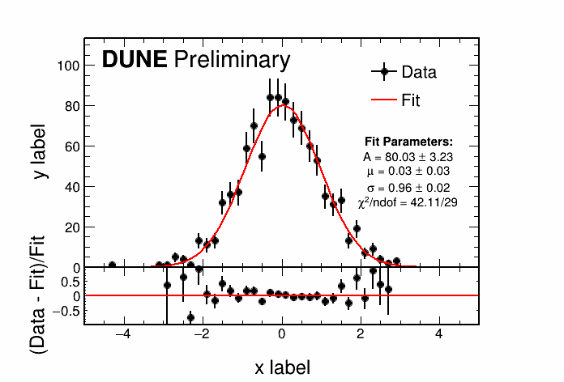
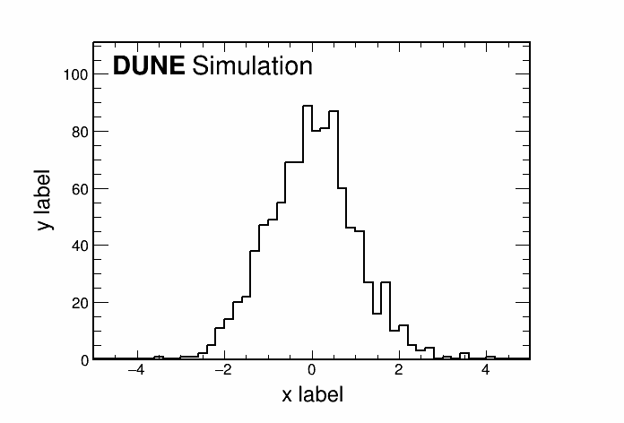
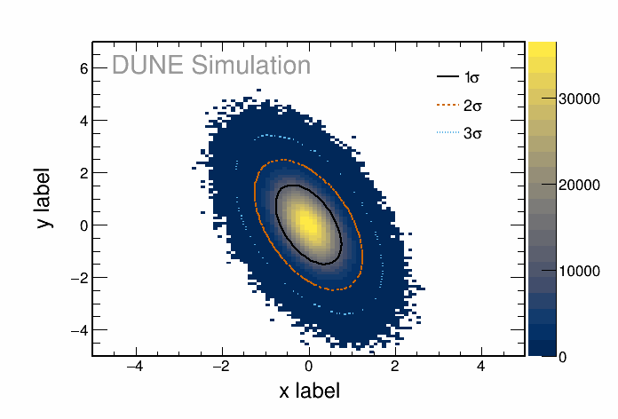
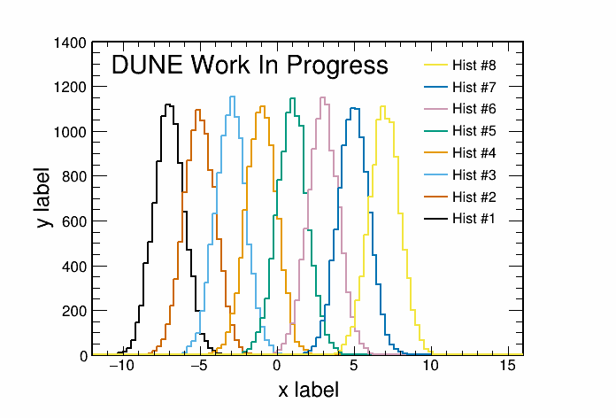
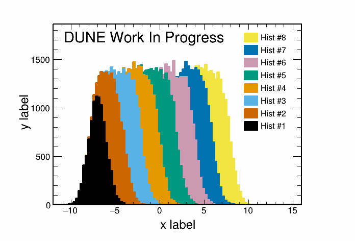
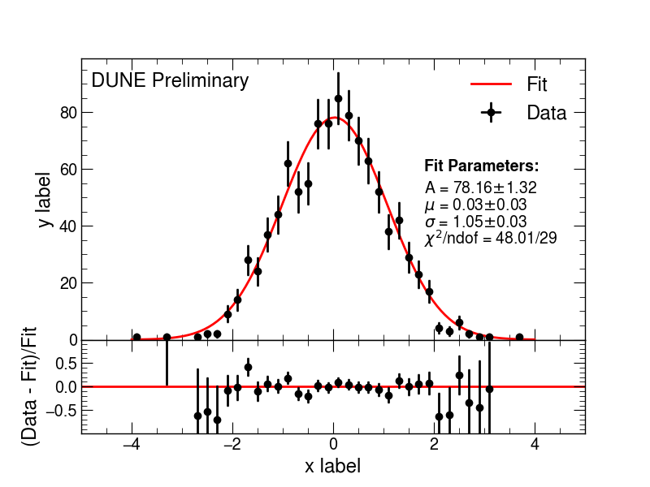
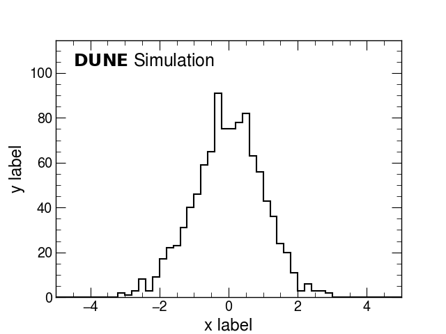
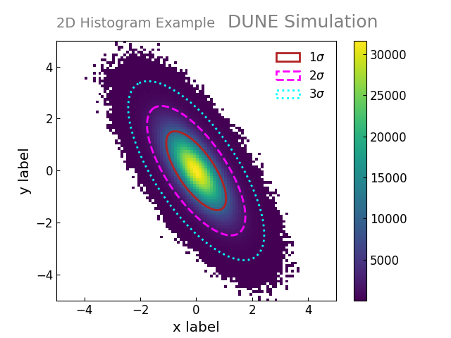
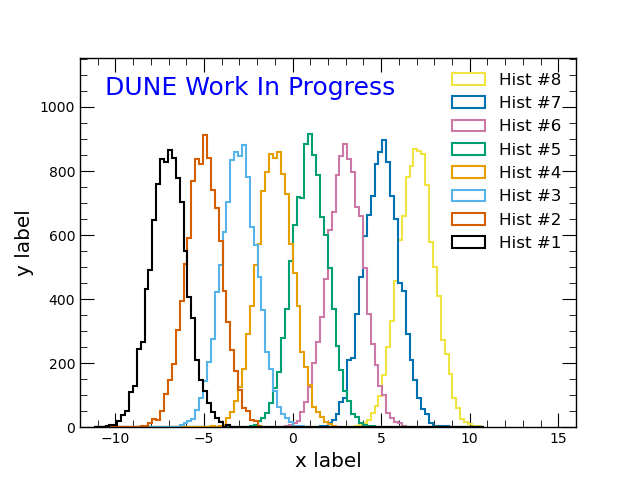
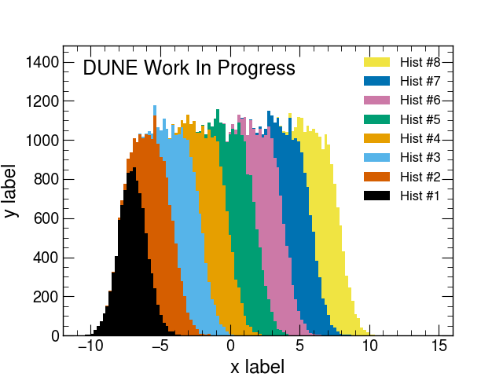

# `dune_plot_style` - DUNE official plot styling tools

This repository contains coding tools to help analyzers easily make plots adhering to the DUNE Plot Style documented at https://wiki.dunescience.org/wiki/DUNE_Plot_Styles.

To illustrate how to use those tools and what the results look like, some examples are also offered.

There are tools designed for use with the most common plotting technologies currently in use:

* ROOT (C++ backend)
* PyROOT
* matplotlib

We welcome bug reports, suggestions, and (especially) code contributions!
Please see [Contributing](#4-Contributing) below.


## 1. Installation

There are a few ways you can use `dune_plot_style`.

### Fermilab UPS package

If you're working on a DUNE GPVM on Fermilab computing resources (`dunegpvmXX.fnal.gov`),
`dune_plot_style` is available as a UPS package
which automatically sets the relevant environment variables for you.

If you're not otherwise familiar with UPS, the relevant procedure goes something like:

```bash
# sets up the UPS system
$ source /cvmfs/dune.opensciencegrid.org/products/dune/setup_dune.sh

# list available versions
$ ups list -aK+ dune_plot_style

# set up a specific version
setup dune_plot_style v01_00
```

At this point you should be able to `from dunestyle import ...` (Python) as described in [How to use the stylistic coding tools](#2-how-to-use-the-stylistic-coding-tools) below.
If you write C++ in scripts executed by running `root` on them, the UPS setup should also set the relevant environment variable
(`$ROOT_INCLUDE_PATH`) for `#include "DUNEStyle.h"` to work as well.
However, if you use C++ ROOT in a compiled project, you should consult either the
[CMake](#c-root-use-with-cmake) or [Standalone C++](#standalone-c-root-setup) sections below.
(The UPS setup adds `dune_plot_style` to the `$CMAKE_PREFIX_PATH` such that the steps below do not require any extra intervention.)


### Standalone Python setup

`dune_plot_style` supports being set up as a standalone Python package.
You'll need to install a handful of common Python libraries for the examples to work.
The recommended way to install these packages is to set up a virtual environment.
This avoids potential package version conflicts and allows you to download the necessary packages on a remote server where you don't have root privileges, such as the GPVMs.

##### Check Python version prerequisites

**`dune_plot_style` requires Python >= 3.9.**
(If you attempt to use an older version, you may encounter issues setting up the dependency chain below.)
You can check what version is currently set up using
```bash
python --version
```

If you'll be using `dune_plot_style` on a machine you control, use your operating system package manager or other suitable means to obtain an appropriate version of Python.

<details><summary>If you are using the tools on a DUNE GPVM, click the arrow to the left to read how to set up the right version of Python.</summary>
You will need to set up a more recent version of Python than the base system version.
The easiest way to do this is to use the UPS system.  First, set that up:

```bash
# sets up the UPS system
$ source /cvmfs/dune.opensciencegrid.org/products/dune/setup_dune.sh
```

* If you intend to use `dune_plot_style` in conjunction with ROOT, simply set up ROOT, as that comes bundled with a Python version dependency.
```bash
# this is the most recent as of the writing of these instructions.
# list all possibilities using `ups list -aK+ root`
$ setup root v6_22_08d -q e20:p392:prof 
```
* If instead you have no interest in setting up ROOT, you can simply set up the Python version you want directly:
```bash
# again, list all possibilities with `ups list -aK+ python`.
# note that a minimum of 3.9 is required
$ setup python v3_9_2
```

**note that these steps will need to be executed for every use**, prior to entering any virtual environments created in the following steps. 
</details>

##### Set up virtual environment and install

```
cd /path/to/venvs # wherever you like to store virtual environments
python3 -m venv my_env
source my_env/bin/activate
```

Next, download the desired version of `dune_plot_style` from [the GitHub releases page](https://github.com/DUNE/dune_plot_style/releases).
You can then install `dune_plot_style` and whatever other packages you need:

```bash
# dependencies first
python3 -m pip install matplotlib numpy scipy

# this is one way to obtain the tarball, but use any way you like
cd /path/to/install/area
export DUNE_PLOT_STYLE_LATEST_TAG=`curl --silent "https://api.github.com/repos/DUNE/dune_plot_style/releases" | jq -r 'map(select(.prerelease == false)) | first | .tag_name'`
wget --no-check-certificate https://github.com/DUNE/dune_plot_style/archive/refs/tags/${DUNE_PLOT_STYLE_LATEST_TAG}.tar.gz -O dune_plot_style.tar.gz
tar -xvzf dune_plot_style.tar.gz

# obviously adjust the directory name for whatever came out of the tarball
cd /path/to/install/area/dune_plot_style
python3 -m pip install .
```

At this point you should be able to `from dunestyle import ...` as described below.

##### Subsequent use

You'll need to set up your virtual environment (and, if on a GPVM, you'll need the UPS setup for Python or ROOT before that) as noted in the previous steps.
You won't need to run the installation instructions more than once, however.

### C++ ROOT use with CMake

As noted in the next section, a single header file provides the entire C++ ROOT interface.
If you are working with a CMake project, `dune_plot_style` includes CMake files that export the `DUNEPlotStyle.h` as a
non-compiled target that your CMake targets can depend on.

#### Installing the CMake package
The CMake files and relevant other package files need to be installed by CMake in order for them to be usable.
This is relatively straightforward:

* Download the source distribution (either `git clone` the repository or download [a tagged source distribution](https://github.com/DUNE/dune_plot_style/releases)). 
* Decide where you want the installed package to go.  
  (`dune_plot_style` is currently configured to create a monolithic install package, rather than install according to the Linux [FHS](https://en.wikipedia.org/wiki/Filesystem_Hierarchy_Standard).)
* Ensure `cmake` is available.

Then:
```bash
# assumes:
# $DUNE_PLOT_STYLE_SRC is downloaded + unrolled source distribution
# $DUNE_PLOT_STYLE_INSTALLDIR is where you want it to go
# $DUNE_PLOT_STYLE_BUILDDIR is a temporary build location that doesn't already exist

# create the build dir
mkdir ${DUNE_PLOT_STYLE_BUILDDIR}; cd ${DUNE_PLOT_STYLE_BUILDDIR}

# configure the package
cmake -DCMAKE_INSTALL_PREFIX=${DUNE_PLOT_STYLE_INSTALLDIR} ${DUNE_PLOT_STYLE_SRC}

# build & install
make install
```

#### Subsequent use

If you installed the package yourself using the steps in the previous section, 
you'll need to ensure that `$DUNE_PLOT_STYLE_INSTALLDIR` is contained in the `$CMAKE_PREFIX_PATH`
for when configuring your own project with cmake.
(If you use the UPS package mentioned previously, this is done automatically for you with package setup.)

Then, when constructing your `CMakeLists.txt`(s), you can load `dune_plot_style`'s CMake files using
```cmake
find_package(DUNEPlotStyle)
```

This exports a `DUNEPlotStyle` interface (=non-compiled) target that you can add as a dependency 
of any target that you're building, which will add the `DUNEPlotStyle.h`'s include path to your target:
```cmake
target_link_libraries(mytarget DUNEPlotStyle)
```

### Standalone C++ ROOT setup

A single header file provides the entire C++ ROOT interface: `src/root/cpp/include/DUNEStyle.h`.
You may download this file independently from the repository, or (recommended), download [a tagged source distribution](https://github.com/DUNE/dune_plot_style/releases).
Then, simply copy it to wherever you would like it to live.

If you are using it exclusively with ROOT macros, you'll need to ensure that the directory where `DUNEStyle.h` is located
is included in the environment variable `$ROOT_INCLUDE_PATH`. This can be done as follows
```
export ROOT_INCLUDE_PATH=/path/to/dir/with/DUNEStyle.h:${ROOT_INCLUDE_PATH}
```
(If you're using the UPS package as described in the previous section, this is done for you automatically.)

If you prefer to build a standalone C++ application/executable, you'll need to ensure the directory where `DUNEStyle.h` is located
is visible to your build system.  For example, with `gcc` or `g++` you'll want to include that directory with `-I`.
This might look like:
```bash
# if you're using the UPS package
g++ -o mytest -I $DUNE_PLOT_STYLE_INC mytest.C

# if you installed by hand
g++ -o mytest -I /path/to/dune_plot_style/src/root/cpp/include mytest.C
```


## 2. How to use the stylistic coding tools

### ROOT (C++)

##### Regular use
There's a C++ header in this package called `DUNEStyle.h`.
Simply `#include` it in your ROOT script(s) to have all subsequent plots take on the basics of DUNE plot style.
(See the [installation](#1-installation) section above for more information on how to make it available).

There are a few stylistic items you'll have to enforce by hand, however.
These have dedicated functions you can invoke:

* "DUNE", "DUNE Simulation", "DUNE Preliminary", "DUNE Work In Progress" watermarks
* Centering axis titles
* Choosing appropriate palettes for "colz" plots

Check out the source of [`DUNEStyle.h`](https://github.com/DUNE/dune_plot_style/blob/main/src/root/cpp/include/DUNEStyle.h)
  for one-stop functions you can call to get this behavior.  They have in-line Doxygen style comments explaining how to use them.
The [examples](#3-examples) noted below also show how to use them.

##### Not applying by default

There may be situations in which you prefer not to enforce the DUNE style on every plot that is made in a particular macro.
In that case, you may set a compile-time define to disable automatic application:

```c++
#define DUNESTYLE_ENABLE_AUTOMATICALLY 0
```

Then, when you're ready, you can apply the DUNE style to any subsequent plots made by calling

```c++
dunestyle::SetDuneStyle();
```

### PyROOT

PyROOT comes pre-installed with most ROOT builds these days, but you should still check that your PyROOT and Python versions are the same:

```bash
root-config --has-pyroot # Gives "yes"

# The output of these next two lines should match
root-config --python3-version 
python3 --version 
```

The PyROOT style tools are simply a wrapper around the C++ ones, and behave the same way once invoked, so see the documentation above for more information about them.

To apply the DUNE style, once you've completed the [installation](#1-installation), all you need is to import the `dunestyle` module:

```python
import dunestyle.root as dunestyle
```

Again the [examples](#3-examples) illustrate more of what you can do.

If you wish to delay the application of the DUNE style, similarly to what's described in the [C++ section](#root-c++), you can set a global flag before importing the `dunestyle` module:

```python
import builtins  #  this only works with Python3...
builtins.__dict__["DUNESTYLE_ENABLE_AUTOMATICALLY"] = False
import dunestyle.root as dunestyle
```

after which you can

```python
dunestyle.enable()
```

to turn it on.

### matplotlib

The matplotlib style tools consist of two parts:
* a ["style sheet"](https://matplotlib.org/stable/tutorials/introductory/customizing.html#using-style-sheets) file which sets most of the default stylings
* an importable module which contains functions to apply watermarks, etc.  This module also applies the style sheet by default (this behavior can be disabled using the same mechanism as described in the [PyROOT section](#pyroot), above).

To enable these, you'll need to install `dune_plot_style` as a Python module.
This will setup the `$MPLCONFIGDIR` environment variable to pick up the style sheet. 

To enable `dunestyle` in your scripts, simply

```python
import dunestyle.matplotlib as dunestyle
```

If you wish to delay the application of the DUNE style, you can use the same technique laid out in the [PyROOT](#pyroot) section above.

See the [examples](#3-examples) for more ideas of what you can do.

## 3. Examples

There are example scripts for ROOT C++, PyROOT, and Matplotlib in the `examples/` directory.
These create a handful of common plot types used in HEP, including stacked histograms, data-to-simulation comparisons, and 2D histograms with confidence contours drawn.
They are built automatically using GitHub's Continuous Integration suite (see [Continuous integration](#5-continuous-integration), below).
You can also generate them yourself to see how they work.

### ROOT

There are C++ and PyROOT examples in `dune_plot_style/examples/root/cpp/example.C` and `dune_plot_style/examples/root/cpp/example.py`, respectively. To run the C++ version, ensure your `$ROOT_INCLUDE_PATH` is set to include the appropriate directory (see [Installation](#1-installation) above).
Then, you can simply
```c++
root -l -b -q example.C
```

Running the PyROOT version is similar.  First ensure your `$PYTHONPATH` is set correctly (again see [Installation](#1-installation) above), then:
```python
python3 example.py
```

The output (which is identical between them) is illustrated below.

<div style="text-align: center">
<a href="examples/images/example.root.datamc.png"></a>
<a href="examples/images/example.root.datamc.png"></a>
<a href="examples/images/example.root.datamc.png"></a>

<a href="examples/images/example.root.histoverlay.png"></a>
<a href="examples/images/example.root.histstacked.png"></a>
</div>


### matplotlib

The matplotlib example script can be found in `dune_plot_style/examples/matplotlib`
To run the example script and produce its plots, simply run

```
python3 example.py
```

from the `examples/matplotlib` subdirectory. Note that you'll need to have `matplotlib`, `numpy`, and `scipy` installed for this to work (see instructions above).  The `matplotlib` versions of the example plots are shown below.

<div style="text-align: center">
<a href="examples/images/example.matplotlib.datamc.png"></a>
<a href="examples/images/example.matplotlib.hist1D.png"></a>
<a href="examples/images/example.matplotlib.hist2D.png"></a>

<a href="examples/images/example.matplotlib.histoverlay.png"></a>
<a href="examples/images/example.matplotlib.histstacked.png"></a>
</div>

## 4. Contributing

If you encounter problems, have a suggestion, or (especially) want to contribute an enhancement or bug-fix,
please use the GitHub tools.

* For bug reports or feature requests, please [file an Issue](https://github.com/DUNE/dune_plot_style/issues).
* To contribute code, please [open a Pull Request](https://docs.github.com/en/pull-requests/collaborating-with-pull-requests/proposing-changes-to-your-work-with-pull-requests/creating-a-pull-request).
* If you're a DUNE collaborator and you need help, visit #plot-style-help on the DUNE Slack.

# 5. Continuous integration

[](https://github.com/DUNE/dune_plot_style/actions/workflows/main.yml)
[](https://github.com/DUNE/dune_plot_style/actions/workflows/main.yml)

To ensure that the examples can be run with the current style,
they are automatically rerun using Github Actions,
in the `ROOT CI` and `Matplotlib CI` workflows,
which are defined in `.github/workflows/*.yml`.
Both workflows cache the dependencies and run automatically for every update to main and for all pull requests,
if files that might affect them were modified.
A whitelist of paths to watch is defined in each workflow.
(The output are stored in the Workflow output directory---see the links above---but the branch is not automatically updated.  Contributions that would automate the branch update are welcome!)

For ROOT, the dependencies are defined in `conda.yml` while the matplotlib dependencies are defined directly in the workflow.

As the repository is public, the CI does not count against the DUNE quota, and both workflows run on Github's public Ubuntu runners.

---

Copyright © 2023 FERMI NATIONAL ACCELERATOR LABORATORY for the benefit of the DUNE Collaboration.

This repository, and all software contained within, is licensed under the Apache
License, Version 2.0 (the "License"); you may not use this file except in compliance
with the License. You may obtain a copy of the License at


`http://www.apache.org/licenses/LICENSE-2.0`


Copyright is granted to FERMI NATIONAL ACCELERATOR LABORATORY on behalf of the Deep
Underground Neutrino Experiment (DUNE). Unless required by applicable law or agreed to
in writing, software distributed under the License is distributed on an "AS IS" BASIS,
WITHOUT WARRANTIES OR CONDITIONS OF ANY KIND, either express or implied. See the
License for the specific language governing permissions and limitations under the
License.
