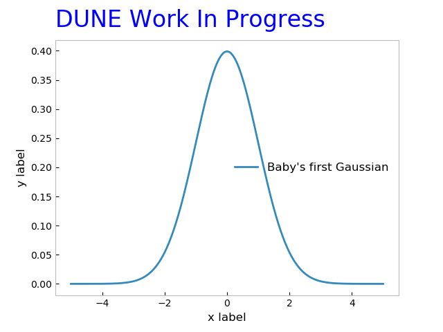

# `dune-plot-style` - DUNE official plot styling tools

This repository contains coding tools to help analyzers easily make plots adhering to the DUNE Plot Style documented at https://wiki.dunescience.org/wiki/DUNE_Plot_Styles.

It also contains tools to help embed metadata in plot images that contain "provenance" info so they can be back-traced if necessary.

To illustrate how to use those tools and what the results look like, some examples are also offered.

## 1. How to use the stylistic coding tools

There are tools designed for use with the most common plotting technologies currently in use:
* ROOT (C++ backend)
* PyROOT
* matplotlib

We welcome contributions for other favored plotting frameworks!  Please [open a pull request](https://docs.github.com/en/pull-requests/collaborating-with-pull-requests/proposing-changes-to-your-work-with-pull-requests/creating-a-pull-request) with any proposed changes.

### ROOT (C++)

##### Regular use
There's a C++ header in this package called `DUNEStyle.h`.
Simply `#include` it in your ROOT script(s) to have all subsequent plots take on the basics of DUNE plot style.
_[**todo**: update with instructions about getting the header into the C++ search path when we know how these tools will be deployed.]_

There are a few stylistic items you'll have to enforce by hand, however.
These have dedicated functions you can invoke:
* "DUNE Simulation", "DUNE Preliminary", "DUNE Work In Progress" watermarks
* Centering axis titles
* Choosing appropriate palettes for "colz" plots
Check out the source of `DUNEStyle.h` for one-stop functions you can call to get this behavior.

##### Not applying by default

There may be situations in which you prefer not to enforce the DUNE style on every plot that is made in a particular macro.
In that case, you may set a compile-time define to disable automatic application:
```c++
#define DUNESTYLE_ENABLE_AUTOMATICALLY 0
```
Then, when you're ready, you can apply the DUNE style to any subsequent plots made by calling
```c++
dunestyle::SetDuneStyle();
```

### PyROOT

_[**todo**: update ]_

PyROOT comes pre-installed with most ROOT builds these days, but you should still check that your PyROOT and Python versions are the same:

```bash
root-config --has-pyroot # Gives "yes"

# The output of these next two lines should match
root-config --python3-version 
python3 --version 
```

The PyROOT style tools are simply a wrapper around the C++ ones, and behave the same way once invoked, so wee the documentation above for more information about them.

To apply the DUNE style, all you need is to import the `dunestyle` module:
```python
import dunestyle.root as dunestyle
```

If you wish to delay the application of the DUNE style, similarly to what's described in the [C++ section](#root-c++), you can set a global flag before importing the `dunestyle` module:
```python
import builtins  #  this only works with Python3...
builtins.__dict__["DUNESTYLE_ENABLE_AUTOMATICALLY"] = False
import dunestyle.root as dunestyle
```
after which you can
```python
dunestyle.enable()
```
to turn it on.

### matplotlib

_[**todo**: update with info about `$MPLCONFIGDIR` and `$PYTHONPATH` when we've sorted out how this will be deployed]_

The matplotlib style tools consist of two parts:
* a ["style sheet"](https://matplotlib.org/stable/tutorials/introductory/customizing.html#using-style-sheets) file which sets most of the default stylings
* an importable module which contains functions to apply watermarks, etc.  This module also applies the style sheet by default (this behavior can be disabled using the same mechanism as described in the [PyROOT section](#pyroot), above).

To enable it, you'll need to install `dune-plot-style/` as a Python module. This will setup the `$MPLCONFIGDIR` environment variable to pick up the style sheet. You'll also need to install a handful of common Python libraries for the examples to work. The recommended way to install these packages is to set up a virtual environment. This avoids potential package version conflicts and allows you to download the necessary packages on a remote server where you don't have root privileges, such as the GPVMs. 

```
cd path/to/dune-plot-style/ # Or wherever you like to store virtual environments
python3 -m venv my_env
source /my_env/bin/activate
```

You can then install `dune-plot-style/` and whatever other packages you need:
```
python3 -m pip install dune-plot-style/ # Trailing backslash is important
python3 -m pip install matplotlib numpy scipy
```

Finally, to enable `dunestyle` in your scripts, simply
```python
import dunestyle.matplotlib as dunestyle
```

## 2. How to use the provenance tracing coding tools
_[ Fill in as appropriate... ]_

## 3. Examples


[](https://github.com/DUNE/dune-plot-style/actions/workflows/main.yml)

_[**todo**: include images from `examples/` dir.  also point out how the various features were obtained with the code in `examples/` ]_

_[**todo**: add ROOT and PyROOT examples]_

### matplotlib

The matplotlib example script can be found in `dune-plot-style/examples/matplotlib`. It creates a handful of common plot types used in HEP, including stacked histograms, data-to-simulation comparisons, and 2D histograms with confidence contours drawn. To run the example script and produce some plots, simply run

```
python3 example.py
```

from the `examples/matplotlib` subdirectory. Note that you'll need to have `matplotlib`, `numpy`, and `scipy` installed for this to work (see instructions above). Some of the example plots are shown below.

_[**todo**: update image(s) in `examples/images/` to match what `example.py` produces]_


